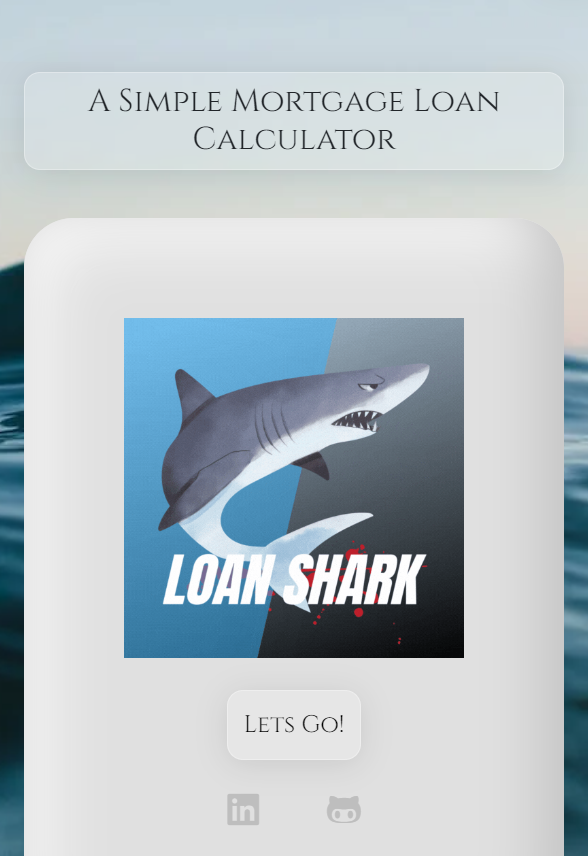

# Loan-Shark-
mortgage loan calculator, try it out with your loan
## Table of Contents

- [Description](#description)
- [Installation](#installation)
- [Usage](#usage)
- [License](#license)
- [Contributors](#Contributors)
- [Deployed Site](#deployed-site)

## Description:

- mortgage loan calculator, try it out with your loan  
- This site solves calculating a loan and prints out the balance, interest, monthly payment, principle, and interest paid over the time of the loan  

## Installation

1. `git clone gh repo clone WixkedLuck/Loan-Shark`
2. Open `index.html`

## Usage
- the purpose of this project is to show a real world problem solved with the use of a website. Using JavaScript fundamentals such as DOM manipulation and Loops we can get the Loan details. 

## License

- N/A 

## Contributors

- WixkedLuck

## Test

- N/A  

_Screenshots of page_

# Deployed Site:
- https://wixkedluck.github.io/Loan-Shark/index.html